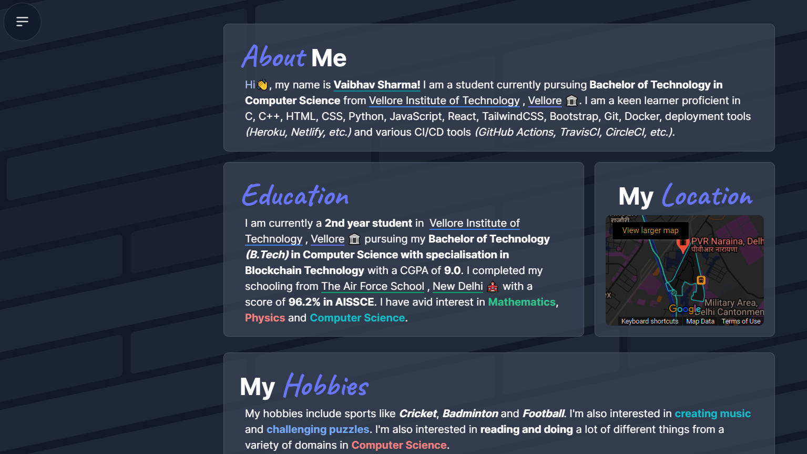

    
    <b><h1 align="center">Simple</h1></b>
    <i><h3 align="center">Simple is my personal website created using React and Tailwind CSS.</h3></i>
    

### _Dependencies_

- [React](https://github.com/facebook/react)
- [React Router](https://github.com/remix-run/react-router)
- [Framer Motion](https://github.com/framer/motion)
- [AOS](https://github.com/michalsnik/aos)
- [Tailwind CSS](https://github.com/tailwindlabs/tailwindcss)
- [Blobity](https://github.com/gmrchk/blobity)
- [react-google-recaptcha](https://github.com/dozoisch/react-google-recaptcha)
- [gh-pages](https://github.com/tschaub/gh-pages)

### _Checkout the license_

### _My social handles_

&ensp;
&ensp;
